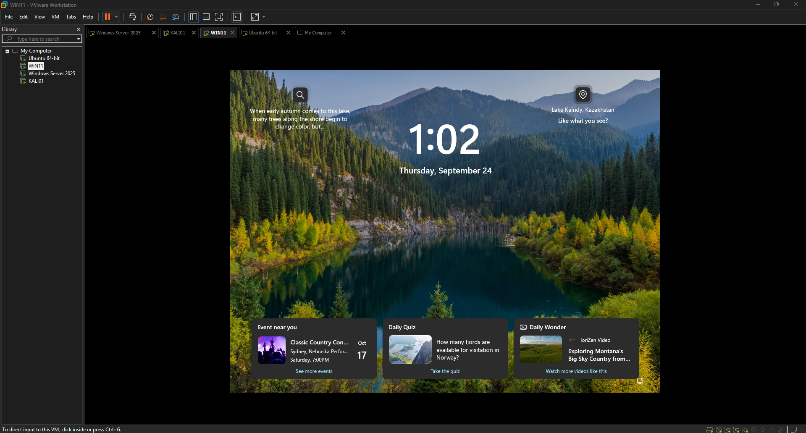
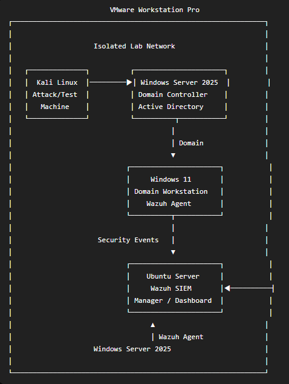
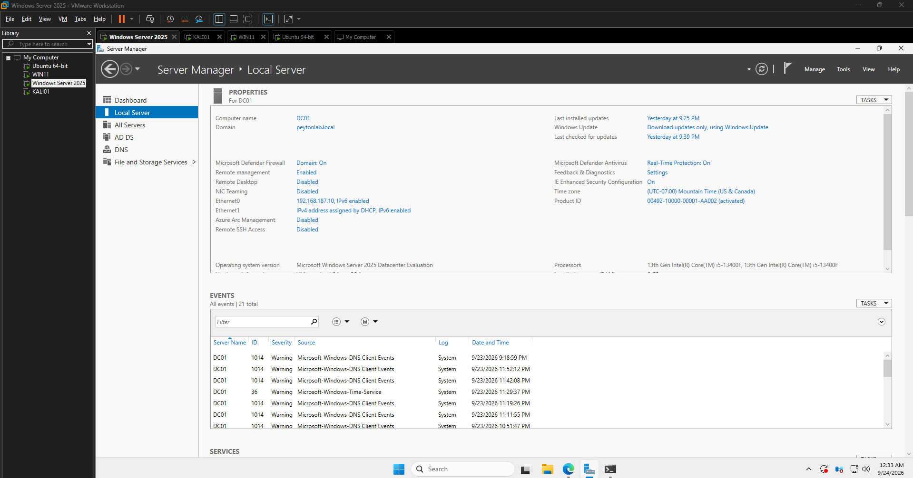
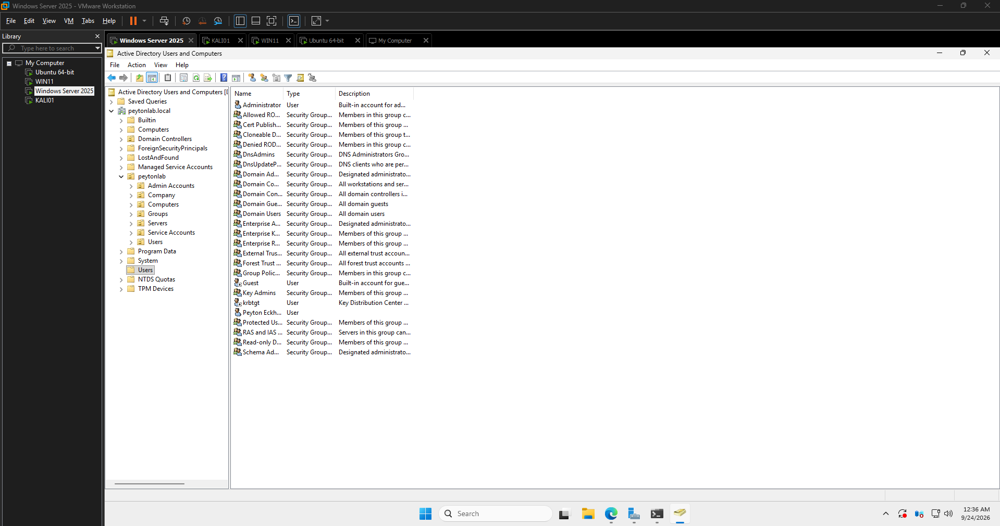
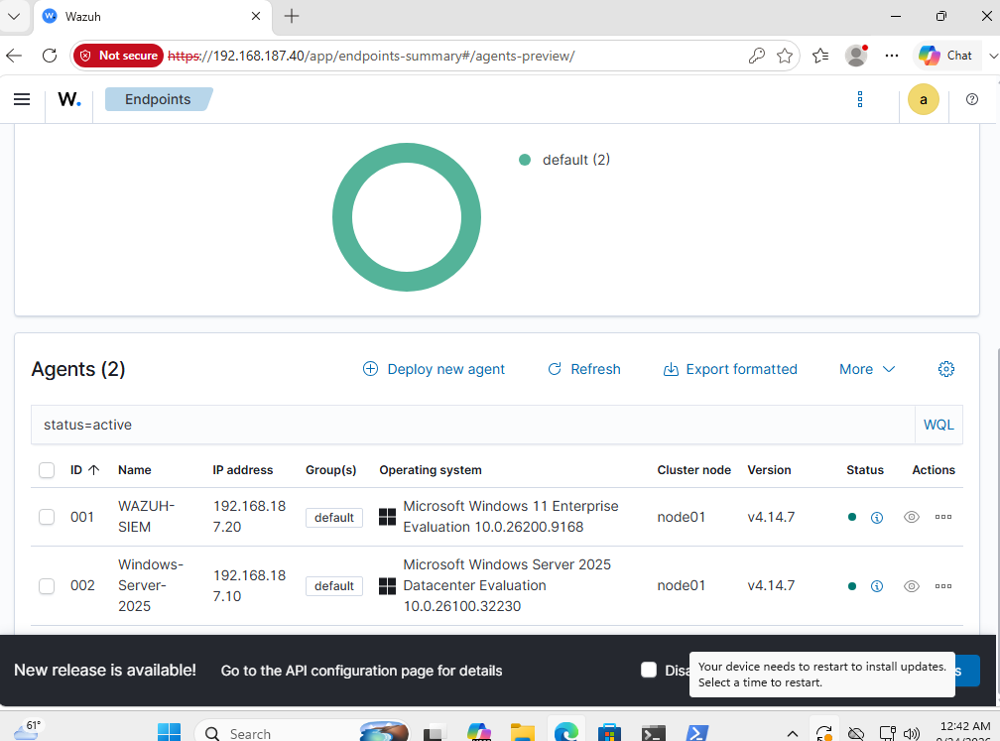
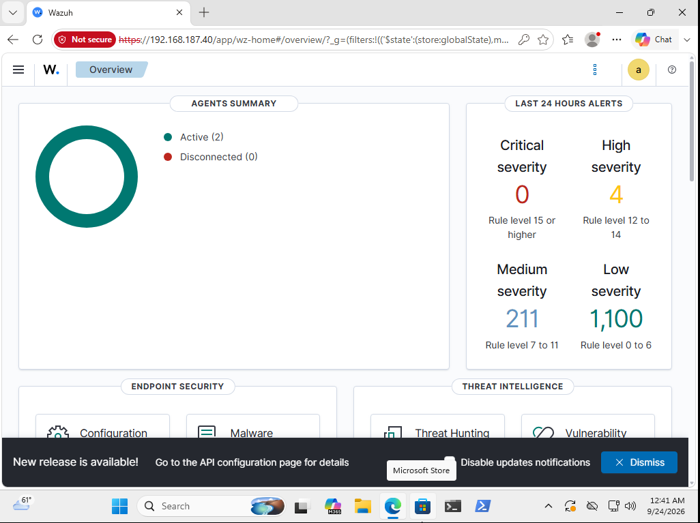

# active-directory-wazuh-attack-detection-lab
Active Directory cybersecurity homelab demonstrating reconnaissance, Kerberos authentication attacks, and threat detection using Kali Linux, Windows Server 2025, Wazuh SIEM, and VMware Workstation Pro.
# Active Directory Attack & Detection Homelab

## 📖 Project Overview

This project documents an Active Directory cybersecurity homelab built using VMware Workstation Pro. The lab was created to practice both offensive security techniques and defensive security monitoring in an isolated environment.

The environment consists of a Windows Server 2025 domain controller, a Windows 11 domain-joined workstation, a Kali Linux security testing machine, and an Ubuntu Server running Wazuh SIEM.

Controlled security tests are performed from Kali Linux against systems and accounts created specifically for the homelab. Wazuh agents installed on the Windows endpoints collect security telemetry that can be analyzed through the Wazuh SIEM.

---

# ⚠️ Disclaimer

All security testing documented in this repository was performed within a privately owned and isolated VMware homelab.

All systems, accounts, credentials, and network resources used for testing were created specifically for cybersecurity education and experimentation.

No third-party systems or accounts were targeted.

---

## 🎯 Objectives

- Build and configure an Active Directory environment
- Join a Windows 11 workstation to the domain
- Deploy Wazuh agents to Windows endpoints
- Perform network reconnaissance with Nmap
- Enumerate Active Directory accounts with Kerbrute
- Simulate authentication attacks against test accounts
- Monitor Windows security events with Wazuh
- Correlate offensive activity with defensive telemetry
- Practice basic security incident investigation

---

## 🧰 Technologies Used

| Technology | Purpose |
|---|---|
| VMware Workstation Pro | Virtualization platform |
| Windows Server 2025 | Active Directory Domain Controller |
| Windows 11 | Domain-joined client |
| Ubuntu Server | Wazuh SIEM server |
| Kali Linux | Security testing workstation |
| Wazuh | SIEM and endpoint monitoring |
| Active Directory | Identity and domain management |
| Nmap | Network reconnaissance |
| Kerbrute | Kerberos/Active Directory security testing |

---

# 🏗️ Lab Architecture

The entire environment is hosted within VMware Workstation Pro and is used only for authorized cybersecurity testing.

## VMware Workstation Environment

The environment contains:

- Kali Linux
- Windows Server 2025
- Windows 11
- Ubuntu Server

## Network Architecture

The lab uses an isolated virtual network hosted in VMware Workstation Pro. Kali Linux serves as the security testing system, Windows Server 2025 provides Active Directory Domain Services, Windows 11 operates as a domain-joined workstation, and Wazuh SIEM running on Ubuntu Server provides centralized security monitoring.

Wazuh agents installed on the Windows Server 2025 domain controller and Windows 11 workstation forward security events to the Wazuh manager for analysis and detection.

---

# 🖥️ Active Directory Environment

## Windows Server 2025 Domain

A Windows 11 workstation was joined to the Active Directory domain to simulate a normal enterprise endpoint.

## Windows Server 2025 Users and Computers

---

# 🛡️ Wazuh SIEM Deployment

Wazuh provides centralized security monitoring for the Windows systems in the homelab.

Wazuh agents were installed on:

- Windows Server 2025
- Windows 11

## Wazuh Agents

This screenshot demonstrates that both Windows endpoints are actively communicating with the Wazuh infrastructure.

## Wazuh Security Dashboard

The Wazuh dashboard provides centralized visibility into security events generated by monitored endpoints.

---

# 🔎 Phase 1 — Network Reconnaissance

## Nmap

Nmap was used from Kali Linux to perform reconnaissance against systems within the isolated homelab.

📸 **SCREENSHOT TO ADD HERE: Nmap scan of the Windows Server/domain controller**

Suggested filename:

`nmap-domain-controller.png`

Future image location:

`/screenshots/03-reconnaissance/nmap-domain-controller.png`

<!--

-->

The scan can be used to identify services associated with the Active Directory environment, such as Kerberos, DNS, LDAP, and SMB.

---

# 👤 Phase 2 — Active Directory Username Enumeration

## Kerbrute User Enumeration

Kerbrute was used from Kali Linux to test a controlled username list against the Active Directory domain controller.

📸 **ADD YOUR KERBRUTE USER ENUMERATION SCREENSHOT HERE**

Suggested filename:

`kerbrute-user-enumeration.png`

Future image location:

`/screenshots/03-reconnaissance/kerbrute-user-enumeration.png`

<!--

-->

### Result

The test successfully identified valid usernames belonging to accounts created specifically for the homelab.

This demonstrates how valid Active Directory usernames can potentially be identified through Kerberos authentication behavior.

---

# 🔑 Phase 3 — Authentication Security Testing

After identifying valid lab accounts, controlled authentication testing was performed against an intentionally configured test account.

## Kerbrute Authentication Testing

📸 **ADD YOUR KERBRUTE SUCCESSFUL AUTHENTICATION SCREENSHOT HERE**

⚠️ **REDACT THE PASSWORD BEFORE UPLOADING THIS IMAGE TO GITHUB.**

Suggested filename:

`kerbrute-password-guessing.png`

Future image location:

`/screenshots/04-authentication-testing/kerbrute-password-guessing.png`

<!--

-->

The authentication test successfully identified a valid username/password combination belonging to a test account within the isolated environment.

Sensitive credentials are intentionally redacted from public documentation.

---

# 🚨 Phase 4 — Wazuh Detection

The Windows endpoints were monitored during the controlled security testing to determine what security telemetry was generated.

## Authentication Events

📸 **SCREENSHOT TO ADD HERE: Wazuh events generated around the time of the Kerbrute test**

Suggested filename:

`wazuh-authentication-events.png`

Future image location:

`/screenshots/05-detection/wazuh-authentication-events.png`

<!--

-->

## Wazuh Event Details

📸 **SCREENSHOT TO ADD HERE: Expanded Wazuh event showing the important fields**

Try to include:

- Timestamp
- Windows Event ID
- Wazuh rule
- Agent name
- Target account
- Source information
- Rule level/severity

Suggested filename:

`wazuh-event-details.png`

Future image location:

`/screenshots/05-detection/wazuh-event-details.png`

<!--

-->

---

# 🔬 Phase 5 — Detection Analysis

The objective of the investigation is to correlate activity generated from Kali Linux with security telemetry recorded by the Windows systems and collected by Wazuh.

The investigation follows the attack path:

Kali Linux  
↓  
Reconnaissance  
↓  
Active Directory Username Enumeration  
↓  
Authentication Testing  
↓  
Windows Security Events  
↓  
Wazuh Agent  
↓  
Wazuh SIEM  
↓  
Detection & Analysis

📸 **OPTIONAL SCREENSHOT TO ADD HERE: Windows Event Viewer showing the corresponding event**

Suggested filename:

`windows-security-event.png`

Future image location:

`/screenshots/05-detection/windows-security-event.png`

<!--

-->

---

# 🧠 Skills Demonstrated

- Active Directory administration
- Windows Server administration
- Windows domain management
- SIEM monitoring
- Windows security event analysis
- Kali Linux
- Network reconnaissance
- Nmap
- Kerbrute
- Kerberos security
- Authentication security testing
- Threat detection
- Security event investigation
- Linux server administration
- VMware virtualization

---

# 🚀 Future Improvements

- Deploy Sysmon for additional endpoint telemetry
- Create custom Wazuh detection rules
- Map detections to MITRE ATT&CK techniques
- Test account lockout detection
- Perform additional Active Directory security testing
- Develop an incident response workflow
- Add additional Windows endpoints
- Expand attack-and-detection scenarios

---

